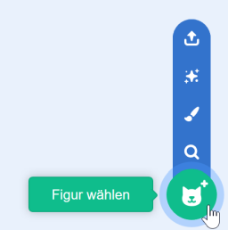
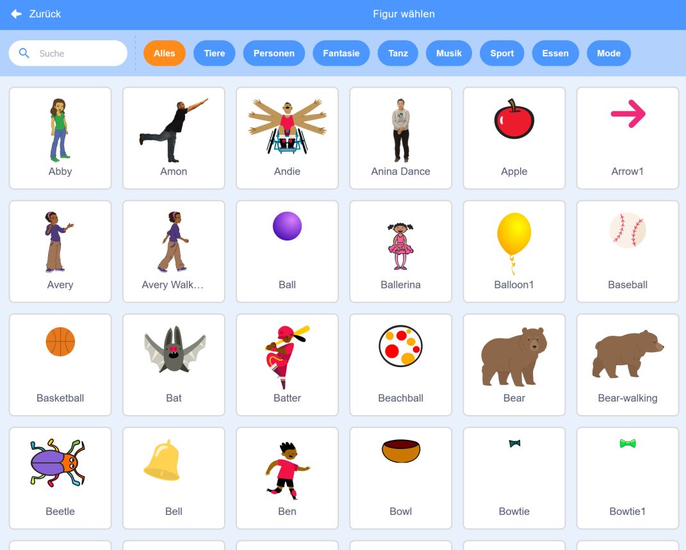

+ Klicke auf **Figur wählen** um die Bibliothek aller in Scratch vorhandener Figuren anzuzeigen.
    
    

+ Du kannst die Figuren themenbezogen suchen und ansehen. Klicke auf eine Figur, um sie in dein Projekt aufzunehmen.
    
    