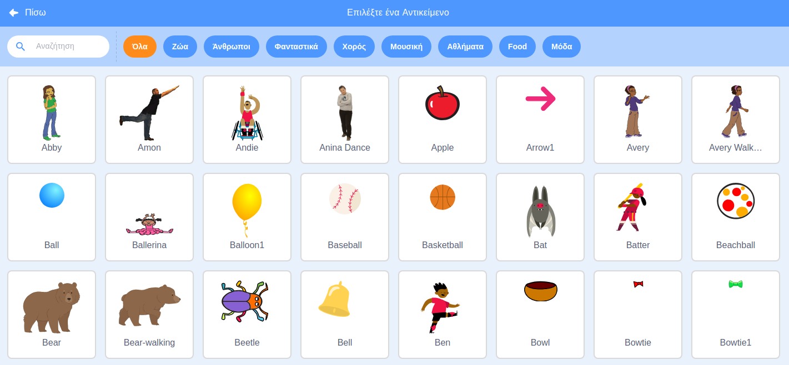

Κάνε κλικ στο **Επιλέξτε ένα Αντικείμενο ** για να ανοίξεις τη Βιβλιοθήκη Αντικειμένων:

Μπορείς να ψάξεις για ένα αντικείμενο ή να αναζητήσεις ένα ανά κατηγορία. Κάνε κλικ σε ένα αντικείμενο για να το προσθέσεις στο έργο σου.

