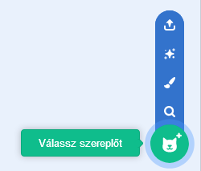
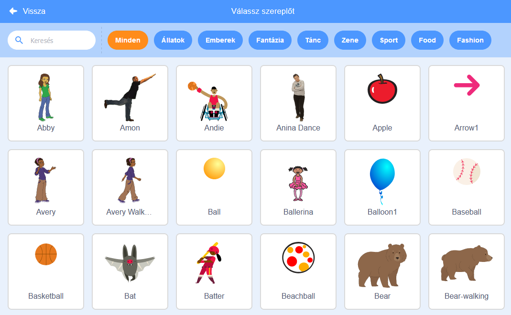

+ Kattints a **Válassz szereplőt** ikonra, hogy megnyisd az összes Scratch szereplő könyvtárát.
    
    

+ Rákereshetsz egy szereplőre, vagy böngészheted őket téma alapján. Kattints egy szereplőre, hogy hozzáadd a projektedhez.
    
    