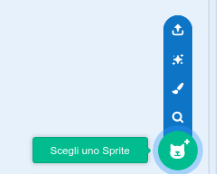
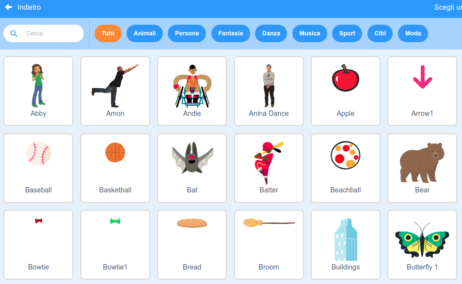

Fai clic su **Scegli uno sprite** per visualizzare tutti gli sprite presenti nella libreria di Scratch.

Puoi cercare o sfogliare gli sprite per tema. Clicca su uno sprite per aggiungerlo al tuo progetto.

