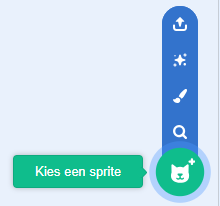
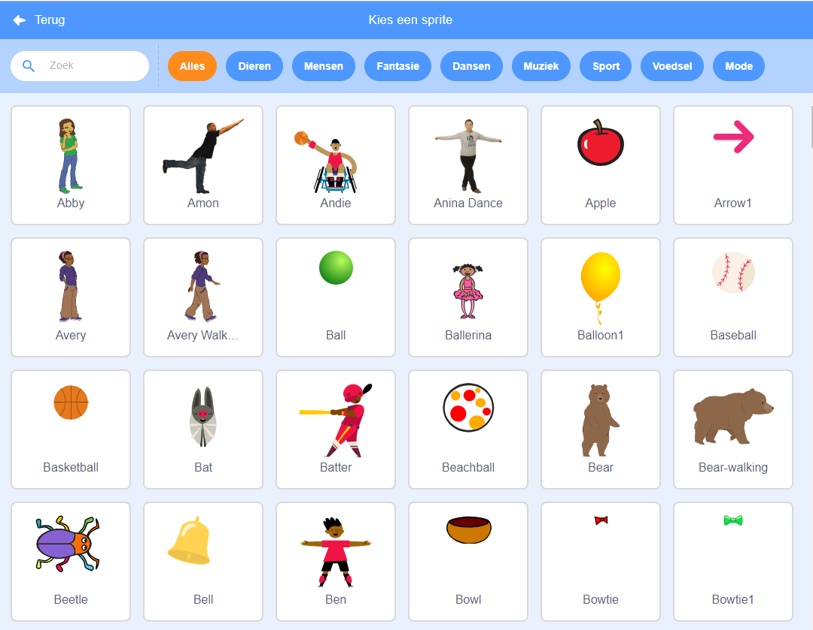

Klik op **Kies een sprite** om de bibliotheek met alle Scratch-sprites te openen:

Je kunt sprites zoeken of er per thema door bladeren. Klik op een sprite om deze toe te voegen aan jouw project.

